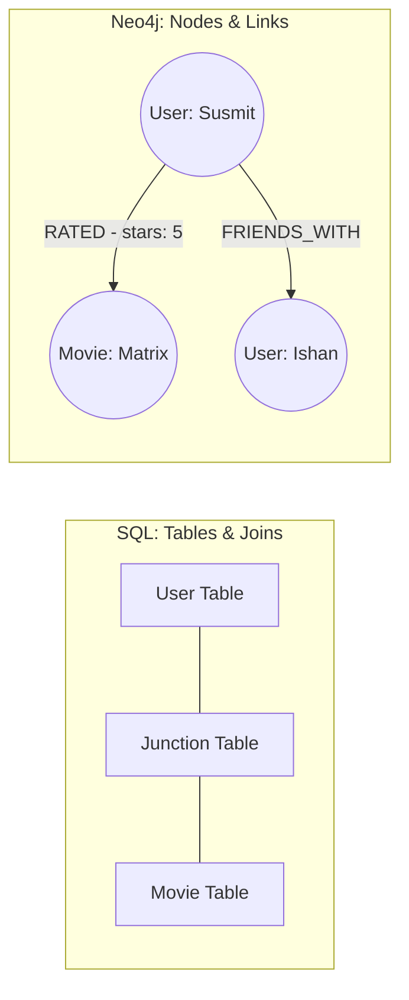
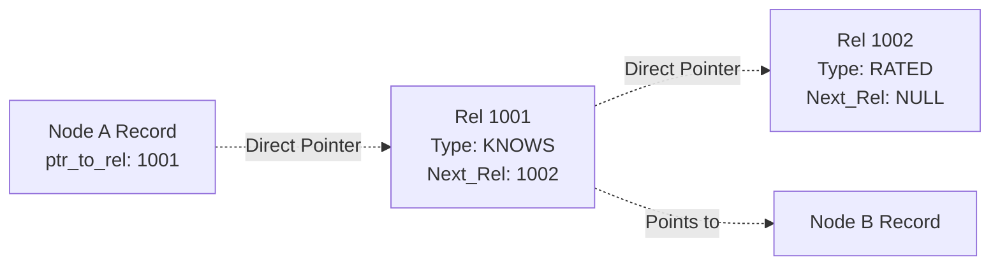
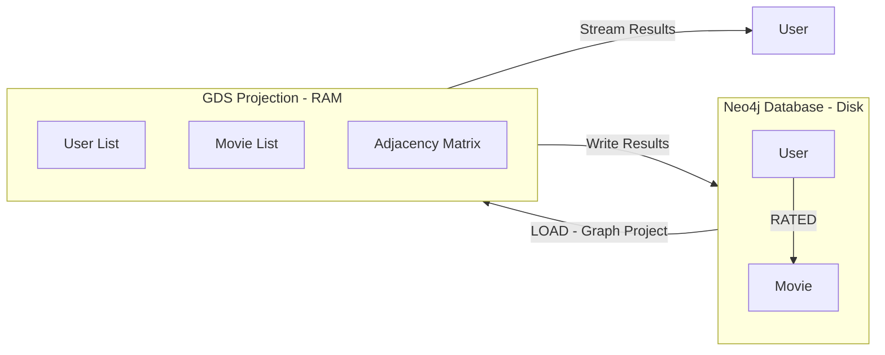

# Neo4j Recommender Workshop: From Zero to Graph Hero


## 1. Introduction (10 Mins)

### Who Am I?
*   **Susmit Vengurlekar**
*   Data Scientist @ AIDAX | Neo4j Certified Professional
*   *Expertise:* 8+ Years Programming, 4+ Years Corporate
*   *Alumni:* DG Ruparel College (BSc IT)

### The Problem with SQL for Recommendations
Imagine you want to find: *"Friends of my Friends who like movies I haven't seen yet."*

**In SQL (Relational DB):**
You need a `Users` table, a `Movies` table, a `Friends` table, and a `Ratings` table.
The query involves massive **JOINs**.
*   Join User to Friends -> Join Friends to their Friends -> Join Friends-of-Friends to Ratings -> Join Ratings to Movies.
*   **Result:** It’s slow, complex, and computationally expensive.

**In Graph (Neo4j):**
We just "walk" the connections.
*   Me -> (knows) -> Friend -> (knows) -> FoF -> (watched) -> Movie.
*   **Result:** Millisecond responses.

### What is a Knowledge Graph?
It is not a table. It is a network.
*   **Nodes:** The "Things" (Nouns) - *e.g., Person, Movie*
*   **Relationships:** The "Connections" (Verbs) - *e.g., ACTED_IN, RATED*
*   **Properties:** Details about them - *e.g., Name, Title, Rating*

#### Visualizing the Difference



---

## 2. Neo4j Internals: Why is it so fast? (5 Mins)

> **Instructor Note:** Explain "Index-Free Adjacency".

In SQL, if I look for your friends, the DB scans an index (like the back of a book) to find the rows.
In Neo4j, the data is stored as a **Linked List** on the hard disk.

### How Data sits on Disk (Simplified)
Every Node has a physical "pointer" (address) to its first relationship. Every Relationship points to the next one.



**The Magic:** To find friends, Neo4j doesn't "search." It just "chases pointers." This is called **Index-Free Adjacency**. It converts a search problem into a traversal problem.

---

## 3. Setup & Syntax (15 Mins)

### Hands-on: Get the Environment
1.  Go to [sandbox.neo4j.com](https://sandbox.neo4j.com)
2.  Login (Email/Google).
3.  Select **"Graph Data Science"** (Featured Project).
4.  Click **"Open"** (Neo4j Browser).

### The Cypher Syntax
Cypher is ASCII Art. You draw what you want to find.

*   `()` represents a Node.
*   `--` represents a Relationship.
*   `-->` represents a Directed Relationship.
*   `[]` contains relationship details.

**Comparison:**

**SQL:**
```sql
SELECT name FROM users WHERE id = 1
```
**Cypher:**
```cypher
MATCH (u:User {id: 1}) RETURN u.name
```

### Step 0: Clean Slate
We need an empty database. Run this:
```cypher
MATCH (n) DETACH DELETE n;
```

---

## 4. Data Loading (The "ETL") (20 Mins)

We are building a Movie Recommender. We need **Constraints**, **Movies**, and **Ratings**.

### A.0 Create Constraints
(Ensures we don't have duplicate Movies or Users. Like a Primary Key).

**Copy/Paste:**
```cypher
CREATE CONSTRAINT user_id IF NOT EXISTS FOR (u:User) REQUIRE u.userId IS UNIQUE;
CREATE CONSTRAINT movie_id IF NOT EXISTS FOR (m:Movie) REQUIRE m.movieId IS UNIQUE;
CREATE CONSTRAINT genre_name IF NOT EXISTS FOR (g:Genre) REQUIRE g.name IS UNIQUE;
```

### A.1 Load Movies & Genres
We will load a CSV, split the genres (e.g., "Action|Adventure"), and connect them.

**Discussion:** Notice `MERGE`. It means "Create if it doesn't exist, otherwise just find it."

**Run This:**
```cypher
LOAD CSV WITH HEADERS FROM
  "https://raw.githubusercontent.com/susmitpy/neo4j_recommender_workshop/refs/heads/main/ml-latest-small/movies.csv"
AS row
WITH row, toInteger(row.movieId) AS movieId

// Create Movie
MERGE (m:Movie {movieId: movieId})
SET m.title = row.title,
    m.url = "https://movielens.org/movies/" + row.movieId

// Handle Genres
WITH m, row.genres AS genres
UNWIND split(genres, "|") AS genre
MERGE (g:Genre {name: genre})
MERGE (m)-[:IN_GENRE]->(g);
```

### A.2 Load Ratings
Users rating movies.

**Run This:**
```cypher
LOAD CSV WITH HEADERS FROM
  "https://raw.githubusercontent.com/susmitpy/neo4j_recommender_workshop/refs/heads/main/ml-latest-small/ratings.csv"
AS row
WITH toInteger(row.userId) AS userId, 
     toInteger(row.movieId) AS movieId, 
     toFloat(row.rating) AS rating

MATCH (m:Movie {movieId: movieId})
MERGE (u:User {userId: userId})
MERGE (u)-[r:RATED]->(m)
SET r.rating = rating;
```

---

## 5. Basic Recommendations (Cypher) (20 Mins)

### Rec Engine 1: Content-Based Filtering
*   *Logic:* "You liked The Matrix? Here are other Action/Sci-Fi movies."

**Exercise:** Find movies that share genres with "Toy Story (1995)".

**The Query:**
```cypher
MATCH (m:Movie {title: "Toy Story (1995)"})-[:IN_GENRE]->(g:Genre)
MATCH (rec:Movie)-[:IN_GENRE]->(g)
WHERE rec <> m // Don't recommend the movie itself
RETURN rec.title, collect(g.name) as sharedGenres, count(g) as overlap
ORDER BY overlap DESC
LIMIT 10;
```

### Rec Engine 2: Collaborative Filtering (The "Wisdom of Crowds")
*   *Logic:* "People who liked Toy Story also liked..."

**The Analogy:**
If User A likes Apples and Bananas.
And User B likes Apples, Bananas, and **Cherries**.
Then User A will probably like **Cherries**.

**Exercise:** Find movies recommended by peers who also liked "Toy Story".

**The Query:**
```cypher
// 1. Find Toy Story
MATCH (m:Movie {title: "Toy Story (1995)"})
// 2. Find users who liked it (Rating > 3)
MATCH (m)<-[r1:RATED]-(u:User) WHERE r1.rating > 3
// 3. Find other movies those users liked
MATCH (u)-[r2:RATED]->(rec:Movie) WHERE r2.rating > 3
// 4. Filter out Toy Story itself
WHERE rec <> m
// 5. Rank by frequency
RETURN rec.title, count(u) as frequent_recommendation
ORDER BY frequent_recommendation DESC
LIMIT 10;
```

---

## 6. Graph Data Science (GDS) (25 Mins)

Before we run the code, we need to understand two concepts: **Projection** and **Similarity**.

### Concept 1: The Graph Projection (The Workbench)

Neo4j stores data on disk (Database). GDS algorithms run in RAM (Memory).
We cannot run complex math directly on the disk because it would be too slow if thousands of users are updating data at the same time.

We create a **Projection**: We take a snapshot of the graph, load it into RAM, and run our math there.



### Concept 2: Node Similarity (Jaccard Index)

How do we know if User A and User B are similar? We look at the **Overlap**.

*   User A watched: `[Matrix, Titanic, Avatar]`
*   User B watched: `[Matrix, Titanic, Shrek]`

Intersection (Same): `[Matrix, Titanic]` (2)
Union (All unique): `[Matrix, Titanic, Avatar, Shrek]` (4)
**Similarity Score:** 2 / 4 = **0.5 (50%)**

We will use GDS to calculate this for *every single pair* of movies to find perfect matches.

---

### Step C.1: Create the Projection
We load `Users`, `Movies`, and the `RATED` relationship into memory.

```cypher
CALL gds.graph.project(
  'myGraph',                // Name of graph in memory
  ['User', 'Movie'],        // Nodes to load
  {
    RATED: {orientation: 'UNDIRECTED'} // Treat rating as a two-way street
  }
);
```

### Step C.2: Run Node Similarity
This compares every movie to every other movie based on who watched them.

```cypher
CALL gds.nodeSimilarity.stream('myGraph')
YIELD node1, node2, similarity
WHERE similarity > 0.5  // Only show strong matches
RETURN gds.util.asNode(node1).title AS Movie_A,
       gds.util.asNode(node2).title AS Movie_B,
       similarity
ORDER BY similarity DESC
LIMIT 10;
```

### Step C.3: The "Hybrid" Recommendation
Now we know exactly which movies are mathematically similar.

**Scenario:** I just watched **"Inception"**. What should I watch next?

1.  Find "Inception".
2.  Use the similarity math (from GDS) to find the closest match.

*(Note: In a real app, we would `.write()` the similarity relationships back to the graph, but for this workshop, we demonstrated the `.stream()` calculation).*

## Want to practice more at home?

You have a couple of options:
1. Use Neo4j Sandbox - <a href="https://sandbox.neo4j.com" target="_blank">sandbox.neo4j.com</a>
2. Aura DB - <a href="https://neo4j.com/product/auradb/" target="_blank">AuraDB</a>
3. Aura Graph Analytics - <a href="https://neo4j.com/product/aura-graph-analytics/" target="_blank">Aura Graph Analytics</a> 
4. Neo4j Desktop Application - <a href="https://neo4j.com/deployment-center/" target="_blank">Download Here</a>
5. Local Setup using Docker Compose (instructions below)

## Local Setup for hands-on practice
1. **Clone the Repository**  
   ```bash
   git clone https://github.com/susmitpy/neo4j_recommender_workshop.git
   cd neo4j_recommender_workshop
    ```

2. **Use Docker Compose to Start Neo4j**  
   Ensure you have Docker and Docker Compose installed. Then run:
   ```bash
   docker-compose up -d
   ```

3. **Access Neo4j Browser**
    Open your web browser and navigate to `http://localhost:7474`. Use the following credentials to log in:
    - Username: `neo4j`
    - Password: `test1234`

## Learning Resources

- Neo4j Official Documentation - [Neo4j Docs](https://neo4j.com/docs/)

- Neo4j Courses @ Graph Academy - [Graph Academy](https://graphacademy.neo4j.com/categories/)

- Neo4j Cypher Refcard - [Cypher Refcard](https://neo4j.com/docs/cypher-refcard/current/)

- Certifications - [Neo4j Certifications](https://graphacademy.neo4j.com/certifications/)
    - Neo4j Certified Professional
    - Neo4j Graph Data Science Certification

- Neo4j Developer Blog on Medium - [Neo4j Developer Blog](https://medium.com/neo4j)

- My session of QnA on Neo4j Knowledge Graph at Graph Database Mumbai Meetup - [Watch Here](https://youtu.be/JpysxH4Z5Fw)

## Wait! What about AI ? 
- Knowledge Graphs are being used to enhance AI models by providing structured context and relationships between data points.
- Neo4j supports vector embeddings and similarity searches, making it easier to integrate with AI applications.
3. LLM Graph Builder - [Neo4j LLM Graph Builder](https://neo4j.com/labs/genai-ecosystem/llm-graph-builder/) is a tool that helps in building knowledge graphs using large language models (LLMs).
4. Don't forget, Data Science is also a key aspect of AI! Neo4j's Graph Data Science Library provides powerful algorithms for graph analytics and machine learning.
