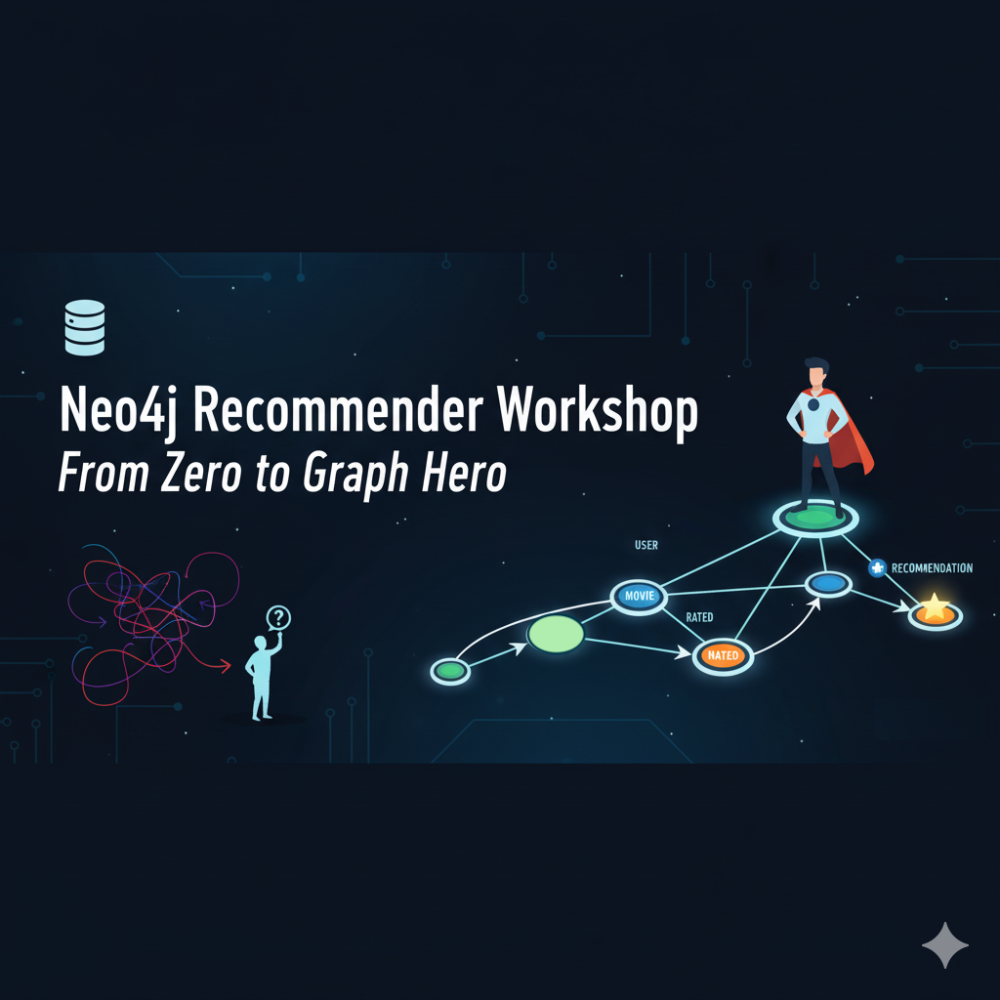
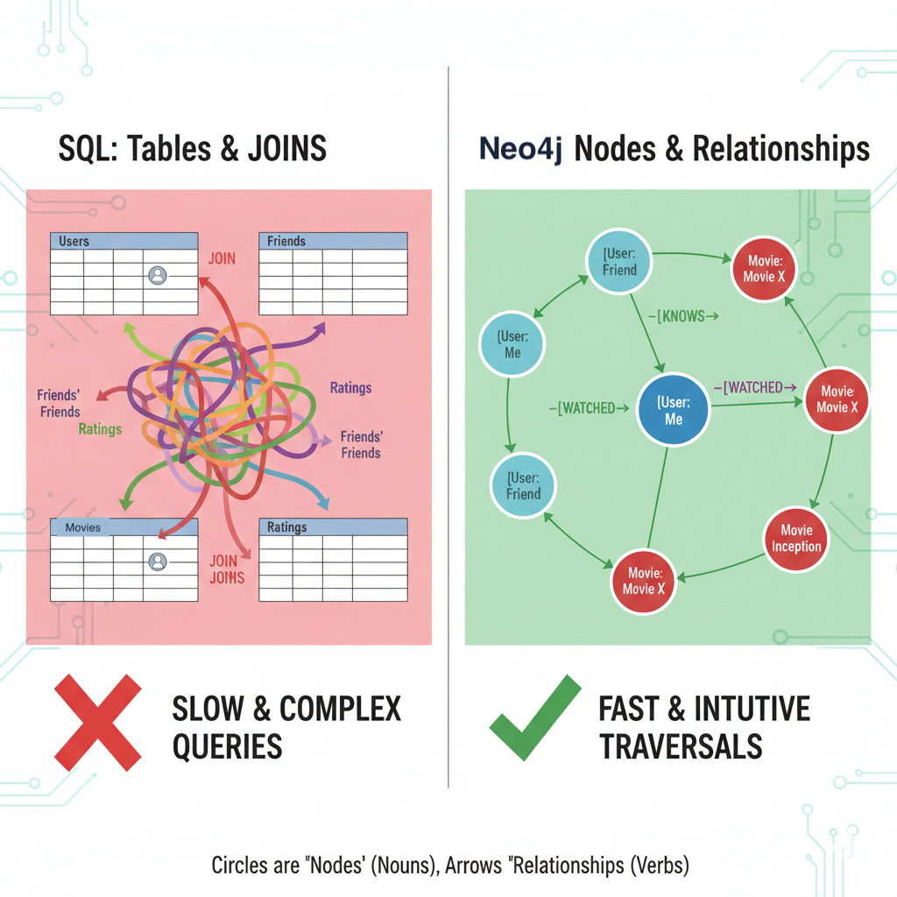
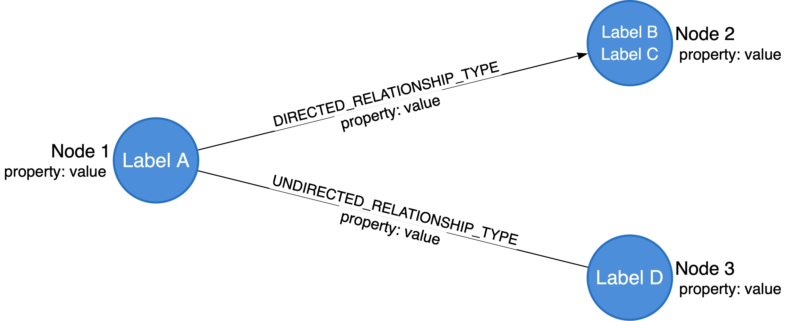
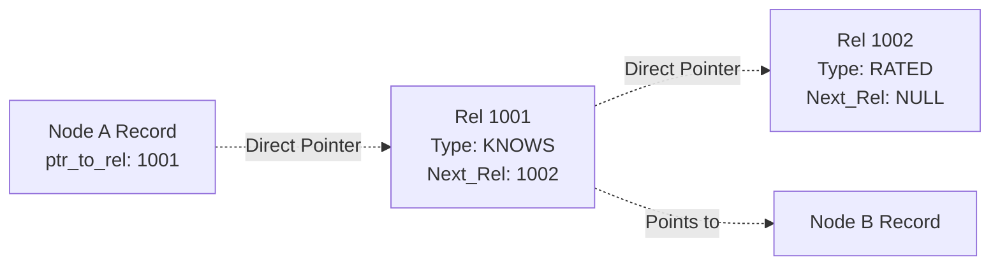
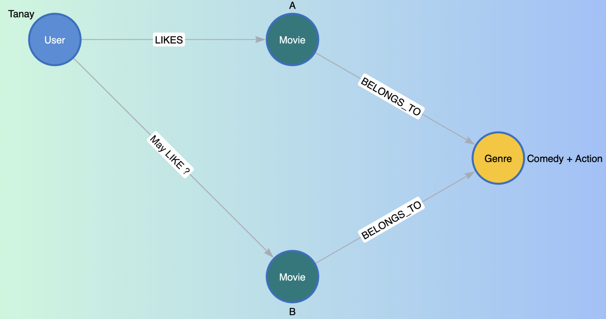
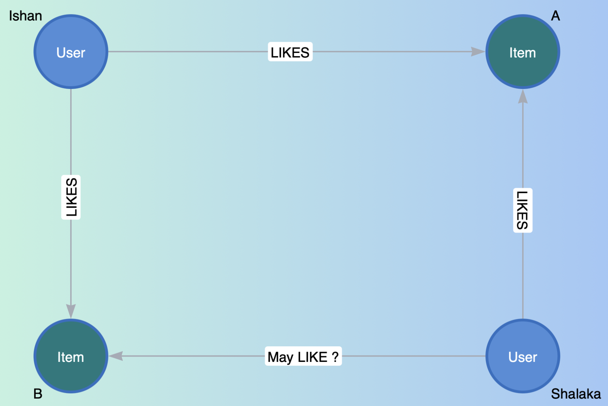
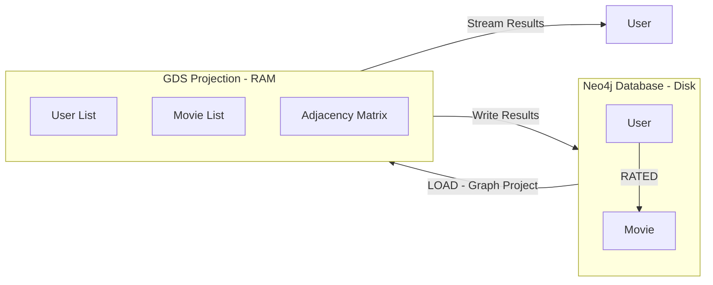

# Neo4j Recommender Workshop: From Zero to Graph Hero



## 1. Introduction

### Who Am I?
*   **Susmit Vengurlekar**
*   Data Scientist @ AIDAX | Neo4j Certified Professional
*   *Expertise:* 8+ Years Programming, 4+ Years Corporate
*   *Alumni:* DG Ruparel College (BSc IT)

### The Problem with SQL for Recommendations
Imagine you want to find: *"Friends of my Friends who like movies I haven't seen yet."*



**In SQL (Relational DB):**
You need a `Users` table, a `Movies` table, a `Friends` table, and a `Ratings` table.
The query involves massive **JOINs**.
*   Join User $\to$ Friends $\to$ Friends' Friends $\to$ Ratings $\to$ Movies.
*   **Result:** It's slow, complex, and computationally expensive (O(n) or worse).

**In Graph (Neo4j):**
We just "walk" the connections.
*   Me $\to$ (knows) $\to$ Friend $\to$ (knows) $\to$ FoF $\to$ (rated) $\to$ Movie.
*   **Result:** Millisecond responses (O(1) - constant time based on relationship depth).

### What is a Knowledge Graph?




---

## 2. Neo4j Internals: Why is it so fast?

In SQL, if I look for your friends, the DB scans an index (like the back of a book) to find the rows.
In Neo4j, the data is stored as a **Linked List** on the hard disk.

### How Data sits on Disk (Simplified)
Every Node has a physical "pointer" (address) to its first relationship. Every Relationship points to the next one.



**The Magic:** To find friends, Neo4j doesn't "search." It just "chases pointers." This is called **Index-Free Adjacency**. It converts a search problem into a traversal problem.

---

## 3. Setup & Syntax

### Hands-on: Get the Environment
1.  Go to [sandbox.neo4j.com](https://sandbox.neo4j.com)
2. Signup
3. Type your email (avoid social login on shared computers)
4. After login, proceed to create project
4.  Select **"Graph Data Science"** (Featured Project).
5.  Click on **Create**
6.  Click **"Open"** (Neo4j Browser).

### The Cypher Syntax


Cypher is ASCII Art. You draw what you want to find.

*   `()` represents a Node.
*   `--` represents a Relationship.
*   `-->` represents a Directed Relationship.
*   `[]` contains relationship details.

**Comparison:**

**SQL:**
```sql
SELECT name FROM users WHERE id = 1
```
**Cypher:**
```cypher
MATCH (u:User {id: 1}) RETURN u.name
```

### Step 0: Clean Slate


We need an empty database. Run this:
```cypher
MATCH (n) DETACH DELETE n;
```

---

## 4. Data Loading

We are building a Movie Recommender. We need **Constraints**, **Movies**, and **Ratings**.

### A.0 The Basics
**1. Create a Test User and Movie**
First, create "Alice" and "The Matrix".
```cypher
CREATE (u:User {name: "Alice"})
CREATE (m:Movie {title: "The Matrix"});
```

**2. Verify Creation**
See what we have.
```cypher
MATCH (n) RETURN n;
```
*(You should see 1 User and 1 Movie)*

**3. Task (Try this query)**
Now, we want to record that Alice rated The Matrix. Run this:
```cypher
MATCH (m:Movie {title: "The Matrix"})
MERGE (u:User {name: "Alice"})-[r:RATED]->(m)
SET r.rating = 5;
```

**4. Correct ??**
Check the graph again.
```cypher
MATCH (n) RETURN n;
```

**The why behind what happened**
`MERGE` matches the **entire pattern**. Since the pattern "Alice connected to Matrix" didn't exist, Neo4j created the *entire pattern*—including a brand new Alice node!

**5. Cleanup**
Let's wipe that mistake.
```cypher
MATCH (u:User {name: "Alice"})-[r:RATED]->(m:Movie)
DELETE r, u;
```

**6. The Correct Way**
To avoid duplicates, `MERGE` the node first (to find it), THEN `MERGE` the relationship.
```cypher
MATCH (m:Movie {title: "The Matrix"})
MERGE (u:User {name: "Alice"})      // Find or Create Alice
MERGE (u)-[r:RATED]->(m)            // Then connect them
SET r.rating = 5;
```

**7. Final Verification**
```cypher
MATCH (n) RETURN n;
```
*(Now you have 1 Alice connected to 1 Matrix. Perfect.)*

**8. Clean Slate (Again)**
Now delete everything so we can start the real workshop.
```cypher
MATCH (n) DETACH DELETE n;
```

### A.1 Create Constraints
(Ensures we don't have duplicate Movies or Users. Like a Primary Key in SQL).

**View current indexes and constraints**
```cypher
show index
```

```cypher
show constraints
```

**Copy/Paste:**
```cypher
CREATE CONSTRAINT user_id IF NOT EXISTS FOR (u:User) REQUIRE u.userId IS UNIQUE;
CREATE CONSTRAINT movie_id IF NOT EXISTS FOR (m:Movie) REQUIRE m.movieId IS UNIQUE;
CREATE CONSTRAINT genre_name IF NOT EXISTS FOR (g:Genre) REQUIRE g.name IS UNIQUE;
```

**Note:** An index is auto-created for all unique constraints. 

**View current indexes and constraints**
```cypher
show constraints
```

```cypher
show index
```

### A.2 Load Movies & Genres
We will load a CSV, split the genres (e.g., "Action|Adventure"), and connect them.

**Run This:**
```cypher
LOAD CSV WITH HEADERS FROM
  "https://raw.githubusercontent.com/susmitpy/neo4j_recommender_workshop/refs/heads/main/ml-latest-small/movies.csv"
AS row
WITH row, toInteger(row.movieId) AS movieId

// Create Movie
MERGE (m:Movie {movieId: movieId})
SET m.title = row.title

// Handle Genres
WITH m, row.genres AS genres
UNWIND split(genres, "|") AS genre
MERGE (g:Genre {name: genre})
MERGE (m)-[:IN_GENRE]->(g);
```

### A.3 Load Ratings
Users rating movies. This connects the `User` nodes to the `Movie` nodes.

**Run This:**
```cypher
LOAD CSV WITH HEADERS FROM
  "https://raw.githubusercontent.com/susmitpy/neo4j_recommender_workshop/refs/heads/main/ml-latest-small/ratings.csv"
AS row
WITH toInteger(row.userId) AS userId, 
     toInteger(row.movieId) AS movieId, 
     toFloat(row.rating) AS rating

MATCH (m:Movie {movieId: movieId})
MERGE (u:User {userId: userId})
MERGE (u)-[r:RATED]->(m)
SET r.rating = rating;
```

### A.4 Verify the Data

```cypher
MATCH 
    p=(u:User {userId:300})-[:RATED]->(m:Movie)-[:IN_GENRE]->(g:Genre)
RETURN p LIMIT 10
```
*(Double-click the bubbles to expand them!)*

---

## 5. Basic Recommendations (Cypher)

### Rec Engine 0: Popularity (The "Trending" List)
Before we get personal, let's just see what everyone is watching.

**Task:**
Write a query to find the top 10 movies with the most ratings.

**Template:**
```cypher
MATCH (m:<FILL>)<-[:RATED]-(u) 
RETURN m.title, count(u) as reviews 
ORDER BY <FILL> 
LIMIT 10;
```

### Rec Engine 1: Content-Based Filtering



*   *Logic:* "You liked The Matrix? Here are other Action/Sci-Fi movies."

**Task:**
Complete the query to find movies that share genres with "Toy Story (1995)" and order them by the number of shared genres.

**Template:**
```cypher
MATCH (m:Movie {title: "Toy Story (1995)"})- <FILL> ->(g:Genre)
MATCH (rec:Movie)-[:IN_GENRE]->(g)
WHERE rec <> <FILL> // Don't recommend the movie itself
RETURN rec.title, collect(g.name) as sharedGenres, count(g) as overlap
ORDER BY <FILL> DESC
LIMIT 10;
```

### Rec Engine 2: Collaborative Filtering (The "Wisdom/Foolishness of Crowds")



*   *Logic:* "People who liked Toy Story also liked..."

**Task:**
Find users who liked "Toy Story (1995)" with a rating > 3, then find other movies they liked (rating > 3), and return the most frequently recommended movies.

**Template:**
```cypher
// 1. Find Toy Story
MATCH (m:Movie {title: "Toy Story (1995)"})
// 2. Find users who liked it (Rating > 3)
MATCH (u:User)-[r1:RATED]->(m) 
WHERE <FILL>
// 3. Find other movies those users liked
MATCH <FILL> WHERE r2.rating > 3 AND rec <> m
// 5. Rank by frequency
RETURN rec.title, count(u) as frequent_recommendation
ORDER BY frequent_recommendation DESC
LIMIT 10;
```

---

## 6. Graph Data Science (GDS)

### The Graph Projection (The Workbench)

Neo4j stores data on disk (Database). GDS algorithms run in RAM (Memory). So we create a **Projection**: We take a snapshot of the graph, load it into RAM, and run our math there.



### Node Similarity (Jaccard Index)

How do we know if User A and User B are similar? We look at the **Overlap**.

*   User A watched: `[Matrix, Titanic, Avatar]`
*   User B watched: `[Matrix, Titanic, Shrek]`

Intersection (Same): `[Matrix, Titanic]` (2)
Union (All unique): `[Matrix, Titanic, Avatar, Shrek]` (4)
**Similarity Score:** 2 / 4 = **0.5 (50%)**

We will use GDS to calculate this for *every single pair* of movies to find perfect matches.

---

### Step C.1: Create the Projection
We load `Users`, `Movies`, and the `RATED` relationship into memory.

**Task:**
Create a graph projection named 'myGraph' with 'User' and 'Movie' nodes and 'RATED' relationships (UNDIRECTED).

**Template:**
```cypher
CALL gds.graph.drop('myGraph', false);
CALL gds.graph.project(
  'myGraph',                // Name of graph in memory
  ['User', <FILL>],        // Nodes to load
  {
    RATED: {orientation: '<FILL>'} // Treat rating as a two-way street
  }
);
```

### Step C.2: Run Node Similarity
This compares every movie to every other movie based on who watched them.

**Task:**
Run the Node Similarity algorithm on 'myGraph' and return pairs with similarity > 0.1.

**Template:**
```cypher
CALL gds.nodeSimilarity.stream('myGraph')
YIELD node1, node2, similarity
WHERE similarity > <FILL>  // Only show strong matches
RETURN gds.util.asNode(node1).title AS Movie_A,
       <FILL>
       similarity
ORDER BY similarity DESC
LIMIT 10;
```

### Step C.3: The "Hybrid" Recommendation
Now we know exactly which movies are mathematically similar.

**Task:** I just watched **"Inception"**. What should I watch next?

1.  Find "Inception (2010)".
2.  Use the similarity math (from GDS) to find the closest match.

**Template:**
```cypher
MATCH (m:Movie <FILL>)
CALL <FILL>
YIELD node1, node2, similarity
WHERE gds.util.asNode(node1) = m AND similarity > 0.1
RETURN gds.util.asNode(node2).title AS Recommendation, similarity
ORDER BY <FILL> DESC
LIMIT 5;
```

*(Note: In a real app, we would `.write()` the similarity relationships back to the graph, but for this workshop, we demonstrated the `.stream()` calculation).*

---

### Personalized PageRank (PPR)

While Node Similarity compares movies based on shared viewers, **Personalized PageRank** takes a different approach. It simulates a "random walk" through the graph starting from a specific node.

Think of it like this: Imagine you're at "Inception" and you randomly walk to users who watched it, then to other movies they watched, then to other users, and so on. The movies you visit most frequently during this walk are considered most relevant to "Inception."

**Key Differences from Node Similarity:**
*   **Node Similarity:** "Which movies have the most overlapping viewers?"
*   **Personalized PageRank:** "If I start from this movie and randomly explore, which movies am I most likely to end up at?"

PPR captures not just direct similarity but also **transitive relationships** – movies connected through chains of users and other movies.

### Step C.4: Run Personalized PageRank

Let's find movies related to "Inception" using PPR.

**Task:**
Run Personalized PageRank starting from "Inception (2010)" and find the top recommended movies.

**Template:**
```cypher
// First, find the Inception node
MATCH (source:Movie {title: "Inception (2010)"})
// Run Personalized PageRank with Inception as the source
CALL gds.pageRank.stream('myGraph', {
  maxIterations: 20,
  dampingFactor: 0.85,
  sourceNodes: [source]
})
YIELD nodeId, score
// Get the movie nodes and filter out the source
WITH gds.util.asNode(nodeId) AS movie, score
WHERE movie:Movie AND movie.title <> "Inception (2010)"
RETURN <FILL>
ORDER BY <FILL> DESC
LIMIT 10;
```

---

## Want to practice more at home?

You have a couple of options:
1. Use Neo4j Sandbox - <a href="https://sandbox.neo4j.com" target="_blank">sandbox.neo4j.com</a>
2. Aura DB - <a href="https://neo4j.com/product/auradb/" target="_blank">AuraDB</a>
3. Aura Graph Analytics - <a href="https://neo4j.com/product/aura-graph-analytics/" target="_blank">Aura Graph Analytics</a> 
4. Neo4j Desktop Application - <a href="https://neo4j.com/deployment-center/" target="_blank">Download Here</a>
5. Local Setup using Docker Compose (instructions below)

## Local Setup for hands-on practice
1. **Clone the Repository**  
   ```bash
   git clone https://github.com/susmitpy/neo4j_recommender_workshop.git
   cd neo4j_recommender_workshop
    ```

2. **Use Docker Compose to Start Neo4j**  
   Ensure you have Docker and Docker Compose installed. Then run:
   ```bash
   docker-compose up -d
   ```

3. **Access Neo4j Browser**
    Open your web browser and navigate to `http://localhost:7474`. Use the following credentials to log in:
    - Username: `neo4j`
    - Password: `test1234`

4. **Loading Data**
   The MovieLens dataset is already included in the `ml-latest-small` folder and mounted to the Neo4j import directory. You can run the following snippet to load the local csv file:
    ```cypher
    LOAD CSV WITH HEADERS FROM 'file:///links.csv' AS row
    ```

## Learning Resources

- Neo4j Official Documentation - [Neo4j Docs](https://neo4j.com/docs/)

- Neo4j Courses @ Graph Academy - [Graph Academy](https://graphacademy.neo4j.com/categories/)

- Neo4j Cypher Refcard - [Cypher Refcard](https://neo4j.com/docs/cypher-refcard/current/)

- Certifications - [Neo4j Certifications](https://graphacademy.neo4j.com/certifications/)
    - Neo4j Certified Professional
    - Neo4j Graph Data Science Certification

- Neo4j Developer Blog on Medium - [Neo4j Developer Blog](https://medium.com/neo4j)

- My session of QnA on Neo4j Knowledge Graph at Graph Database Mumbai Meetup - [Watch Here](https://youtu.be/JpysxH4Z5Fw)

## Wait! What about AI ? 
- Knowledge Graphs are being used to enhance AI models by providing structured context and relationships between data points (RAG).
- Neo4j supports vector embeddings and similarity searches, making it easier to integrate with AI applications.
- LLM Graph Builder - [Neo4j LLM Graph Builder](https://neo4j.com/labs/genai-ecosystem/llm-graph-builder/) is a tool that helps in building knowledge graphs using large language models (LLMs).
- Neo4j MCP Server
- Example Project - [Invoice Chatbot](https://github.com/vivekvedant/invoice_chatbot) by [Vivek Vedant](https://www.linkedin.com/in/vivek-vedant/)

## Licenses

Dataset License Notice

This workshop uses the MovieLens ml-latest-small dataset, which is
licensed by GroupLens Research, University of Minnesota, under the following conditions:

Non-commercial use only

Must include attribution

Must not imply endorsement

Redistribution allowed only under same terms

Dataset source: https://grouplens.org/datasets/movielens/

Citation:

F. Maxwell Harper and Joseph A. Konstan. 2015… https://doi.org/10.1145/2827872

Note:
The MovieLens dataset license applies only to the dataset.
All workshop code and teaching material in this repository remain under the MIT License.

## Disclaimer
* This workshop is for educational purposes only.
* The images used are for illustrative purposes and may not represent actual Neo4j products or services. 
* AI generated content is used as is or with minor modifications for educational purposes.
