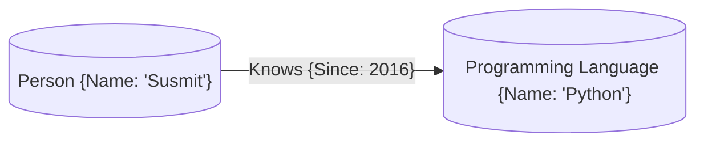

# Neo4j Recommender Workshop

## About Me

### Susmit Vengurlekar

### Data Scientist, Backend Developer, AWS Solutions Architect, Neo4j Professional

- Data Scientist at AIDAX
- Certified Neo4j Professional
- Programming Experience of **8+ years**, Corporate Experience of **4+ years** 
- HSC Commerce & Bsc IT from DG Ruparel College, Mumbai

## Let's Cover the Basics first

### What is a Knowledge Graph?

- A Knowledge Graph is a graph database that stores information in the form of nodes and edges
- Nodes represent entities and edges represent relationships between entities
- Properties can be attached to nodes and edges

#### Example




### Intro to Neo4j

- Graph database
- Labels, Nodes, Relationships, and Properties
- Native Graph Storage: Store data using pointers on disk
- Cypher Query Language
- Create only directed relationships, but traverse them any way.


### Intro to Neo4j - Cypher Query Language

#### To find all actors who acted in the movie "The Matrix"


#### Instead of this
```sql
SELECT actors.name
FROM actors
 	LEFT JOIN acted_in ON acted_in.actor_id = actors.id
	LEFT JOIN movies ON movies.id = acted_in.movie_id
WHERE movies.title = "The Matrix"
```

### You can write this
```cypher
MATCH (actor:Actor)-[:ACTED_IN]->(movie:Movie {title: 'The Matrix'})
RETURN actor.name
```


## Enough Talk, Time to Get our Hands Dirty!

1. Visit this Github Repository - [https://bit.ly/neo4j-vsit-2025](https://github.com/susmitpy/neo4j_recommender_workshop)</a>

2. Spin up neo4j sandbox by going to <a href="https://sandbox.neo4j.com" target="_blank">sandbox.neo4j.com</a>

3. Login with Email ID and Password (if you use social login, don't forget to signout after the session)

4. Choose "Graph Data Science" from the "Featured Dataset" section
5. Open Neo4j Browser (it opens in a new tab)

6. Click on authentication type and choose "Username and Password"

7. You can find the password in the "Connection Details" section on the sandbox page 

8. Your first step is to delete the existing data. Run the following command in the query editor
```cypher
MATCH (n) DETACH DELETE n;
```

Nice, this format will make it much easier to teach and later turn into “solutions” vs “student sheet”.

Below is a **drop-in workshop script**, structured as:

* Sections **A, B, C**
* Each exercise:

  1. **Example** – describe scenario + show a Cypher query
  2. **Your Turn** – question for students
  3. **Answer** – full solution (you can move these to a separate file later)

---

# A. Getting the Graph Ready (Basics)

## A.0 – Create Constraints (Indexes)

> **Goal:** Show how to make lookups fast and avoid duplicate nodes.

### Example A.0 – Constraint on `Movie`

**Scenario**

We want to ensure each `Movie` is uniquely identified by `movieId`. Neo4j can enforce this with a **uniqueness constraint**, which also creates an index.

**Example Query**

```cypher
// Create a uniqueness constraint for Movie.movieId
CREATE CONSTRAINT movie_id IF NOT EXISTS
FOR (m:Movie)
REQUIRE m.movieId IS UNIQUE;
```

---

### Your Turn – Exercise A.0

Create similar uniqueness constraints for:

* `User.userId`
* `Genre.name`
* `Tag.name`

You can use this **template** and replace `<fill here>`:

```cypher
CREATE CONSTRAINT <fill here> IF NOT EXISTS
FOR (n:<fill here>)
REQUIRE n.<fill here> IS UNIQUE;
```

#### Answer A.0

```cypher
// Users
CREATE CONSTRAINT user_id IF NOT EXISTS
FOR (u:User)
REQUIRE u.userId IS UNIQUE;

// Genres
CREATE CONSTRAINT genre_name IF NOT EXISTS
FOR (g:Genre)
REQUIRE g.name IS UNIQUE;

// Tags
CREATE CONSTRAINT tag_name IF NOT EXISTS
FOR (t:Tag)
REQUIRE t.name IS UNIQUE;
```

---

## A.1 – Load Movies and Genres from CSV

> **Goal:** Learn `LOAD CSV`, basic `MERGE`, and modeling genres as separate nodes.

CSV URL:

```text
https://raw.githubusercontent.com/susmitpy/neo4j_recommender_workshop/refs/heads/main/ml-latest-small/movies.csv
```

### Example A.1 – Load Movies Without Genres

**Scenario**

First, we’ll just create movies with `movieId` and `title` from the CSV, ignoring genres and year.

**Example Query**

```cypher
LOAD CSV WITH HEADERS FROM
  "https://raw.githubusercontent.com/susmitpy/neo4j_recommender_workshop/refs/heads/main/ml-latest-small/movies.csv"
AS row

WITH row, toInteger(row.movieId) AS movieId, row.title AS title

MERGE (m:Movie {movieId: movieId})
SET m.title = title;
```

---

### Your Turn – Exercise A.1

Now extend this to:

1. Extract the **year** from the title (e.g. `"Toy Story (1995)"` → `1995`) and store it as `m.year`.
2. Split the `genres` string (e.g. `"Adventure|Animation|Children"`) into multiple `Genre` nodes.
3. Connect each movie to its genres with `(:Movie)-[:IN_GENRE]->(:Genre)`.

**Write the full query**.

#### Answer A.1

```cypher
LOAD CSV WITH HEADERS FROM
  "https://raw.githubusercontent.com/susmitpy/neo4j_recommender_workshop/refs/heads/main/ml-latest-small/movies.csv"
AS row

WITH row,
     toInteger(row.movieId) AS movieId,
     row.title AS title,
     row.genres AS genresString,
     // extract 4-digit year inside parentheses, if present
     apoc.text.regexGroups(title, ".*\\((\\d{4})\\).*") AS yearMatch

MERGE (m:Movie {movieId: movieId})
SET m.title = title,
    m.year  = CASE
                WHEN size(yearMatch) > 0 THEN toInteger(yearMatch[0][1])
                ELSE null
              END

WITH m, genresString
WHERE genresString IS NOT NULL
  AND genresString <> "(no genres listed)"

UNWIND split(genresString, "|") AS genreName
MERGE (g:Genre {name: genreName})
MERGE (m)-[:IN_GENRE]->(g);
```

---

## A.2 – Load Users and Ratings from CSV

> **Goal:** Build the `User`–`RATED`–`Movie` graph.

CSV URL:

```text
https://raw.githubusercontent.com/susmitpy/neo4j_recommender_workshop/refs/heads/main/ml-latest-small/ratings.csv
```

### Example A.2 – Create One Rating

**Scenario**

Imagine user 1 rated movie 1 with 4.0. We could manually create:

**Example Query**

```cypher
MERGE (u:User {userId: 1})
MERGE (m:Movie {movieId: 1})
MERGE (u)-[r:RATED]->(m)
SET r.rating = 4.0;
```

---

### Your Turn – Exercise A.2

Load all ratings from `ratings.csv`:

1. Create or reuse `User` nodes by `userId`.
2. Match existing `Movie` nodes by `movieId`.
3. Create `RATED` relationships with properties:

   * `rating` (float)
   * `timestamp` (integer)

You can use this **template**:

```cypher
LOAD CSV WITH HEADERS FROM
  "<fill here>"
AS row

WITH
  toInteger(row.userId)    AS userId,
  toInteger(row.movieId)   AS movieId,
  toFloat(row.rating)      AS rating,
  toInteger(row.timestamp) AS ts

MERGE (<fill here>:User {userId: userId})
WITH <fill here>, movieId, rating, ts
MATCH (m:Movie {movieId: movieId})
MERGE (<fill here>)-[r:RATED]->(m)
SET r.rating    = <fill here>,
    r.timestamp = <fill here>;
```

#### Answer A.2

```cypher
LOAD CSV WITH HEADERS FROM
  "https://raw.githubusercontent.com/susmitpy/neo4j_recommender_workshop/refs/heads/main/ml-latest-small/ratings.csv"
AS row

WITH
  toInteger(row.userId)    AS userId,
  toInteger(row.movieId)   AS movieId,
  toFloat(row.rating)      AS rating,
  toInteger(row.timestamp) AS ts

MERGE (u:User {userId: userId})
WITH u, movieId, rating, ts
MATCH (m:Movie {movieId: movieId})
MERGE (u)-[r:RATED]->(m)
SET r.rating    = rating,
    r.timestamp = ts;
```

---

## A.3 – Quick Exploration Query

> **Goal:** Let them “see” something interesting quickly.

### Example A.3 – 5 Random Movies

**Scenario**

Show 5 random movies to prove data is loaded.

**Example Query**

```cypher
MATCH (m:Movie)
RETURN m.title AS title, m.year AS year
ORDER BY rand()
LIMIT 5;
```

---

### Your Turn – Exercise A.3

Find the **top 10 most rated movies**:

* Show `movie` title
* Number of ratings (`numRatings`)
* Average rating (`avgRating`)
* Order by `numRatings` descending

**Write the full query.**

#### Answer A.3

```cypher
MATCH (:User)-[r:RATED]->(m:Movie)
RETURN m.title AS movie,
       count(r) AS numRatings,
       round(avg(r.rating), 2) AS avgRating
ORDER BY numRatings DESC
LIMIT 10;
```

---

# B. Recommendation with Pure Cypher

## B.1 – Content-Based: Similar Movies by Genre

> **Goal:** Show how structure (genres) can drive recommendations.

We’ll use `"Toy Story (1995)"` as an example anchor movie.

### Example B.1 – Same Genres, Different Movies

**Scenario**

Find movies that share at least one genre with `"Toy Story (1995)"`.

**Example Query**

```cypher
MATCH (m:Movie {title: "Toy Story (1995)"})-[:IN_GENRE]->(g:Genre)
MATCH (other:Movie)-[:IN_GENRE]->(g)
WHERE other <> m
RETURN other.title AS similarMovie,
       collect(DISTINCT g.name) AS sharedGenres
LIMIT 10;
```

---

### Your Turn – Exercise B.1

Write a query that:

1. Finds `"Toy Story (1995)"` and its genres.
2. Finds **other movies** that share those genres.
3. Counts how many genres they share as `numSharedGenres`.
4. Sorts by `numSharedGenres` (DESC), then by title.
5. Returns top 20 movies.

You can use this **template**:

```cypher
MATCH (m:Movie {title: "Toy Story (1995)"})-[:IN_GENRE]->(g:Genre)
MATCH (m2:Movie)-[:IN_GENRE]->(g)
WHERE <fill here>
RETURN m2.title AS similarMovie,
       collect(DISTINCT g.name) AS sharedGenres,
       size(<fill here>) AS numSharedGenres
ORDER BY <fill here> DESC, similarMovie
LIMIT 20;
```

#### Answer B.1

```cypher
MATCH (m:Movie {title: "Toy Story (1995)"})-[:IN_GENRE]->(g:Genre)

MATCH (m2:Movie)-[:IN_GENRE]->(g)
WHERE m2 <> m

WITH m2, collect(DISTINCT g.name) AS sharedGenres
RETURN m2.title AS similarMovie,
       sharedGenres,
       size(sharedGenres) AS numSharedGenres
ORDER BY numSharedGenres DESC, similarMovie
LIMIT 20;
```

---

## B.2 – Collaborative: Find Similar Users

> **Goal:** Users are similar if they like the same movies.

We pick `User 1` as our demo user.

### Example B.2 – Users Who Like the Same Movie

**Scenario**

Find all users who rated **`"Toy Story (1995)"`** with a rating ≥ 4.0.

**Example Query**

```cypher
MATCH (m:Movie {title: "Toy Story (1995)"})<- [r:RATED]-(u:User)
WHERE r.rating >= 4.0
RETURN u.userId AS userId, r.rating AS rating;
```

---

### Your Turn – Exercise B.2

Find **similar users to `User 1`** as follows:

1. Get movies where `User 1` rating ≥ 4.0.
2. Find other users who also rated those movies ≥ 4.0.
3. Count how many such common “liked” movies they share.
4. Only keep users with at least 3 common liked movies.
5. Return `similarUser` and `commonLikes`, ordered by `commonLikes` descending.

**Write the full query.**

#### Answer B.2

```cypher
// Movies that User 1 liked (rating >= 4.0)
MATCH (u1:User {userId: 1})-[r1:RATED]->(m:Movie)
WHERE r1.rating >= 4.0

// Other users who also liked those movies
MATCH (u2:User)-[r2:RATED]->(m)
WHERE u2 <> u1
  AND r2.rating >= 4.0

WITH u2, collect(DISTINCT m) AS commonLikedMovies
WHERE size(commonLikedMovies) >= 3

RETURN u2.userId AS similarUser,
       size(commonLikedMovies) AS commonLikes
ORDER BY commonLikes DESC, similarUser
LIMIT 20;
```

---

## B.3 – Collaborative: Recommend Movies from Similar Users

> **Goal:** Classic user–user collaborative filtering.

### Example B.3 – Movies Liked by One Similar User

**Scenario**

Assume we already know that `User 2` is similar to `User 1`. We want to find movies `User 2` likes that `User 1` hasn’t rated yet.

**Example Query**

```cypher
MATCH (u1:User {userId: 1})
MATCH (u2:User {userId: 2})

// Movies user 1 has rated
MATCH (u1)-[r1:RATED]->(mRated:Movie)
WITH u1, u2, collect(mRated) AS u1Movies

// Movies user 2 likes
MATCH (u2)-[r2:RATED]->(rec:Movie)
WHERE r2.rating >= 4.0 AND NOT rec IN u1Movies

RETURN rec.title AS candidateMovie, r2.rating AS user2Rating
LIMIT 10;
```

---

### Your Turn – Exercise B.3

Now **combine** similar users and recommendations:

1. Reuse the **similar user** logic from Exercise B.2 (users who share ≥ 3 liked movies with `User 1`).
2. From those similar users, collect movies they like (rating ≥ 4.0) that `User 1` has **not** rated.
3. For each candidate movie, count how many similar users liked it (`numSimilarUsersLiked`).
4. Return top 20 recommended movies ordered by `numSimilarUsersLiked` (DESC) and average rating from those similar users.

This is a bit long; you can give them this **template**:

```cypher
// Step 1: Movies User 1 has rated
MATCH (u1:User {userId: 1})-[r1:RATED]->(mRated:Movie)
WITH u1, collect(mRated) AS u1Movies

// Step 2: Find similar users (like Exercise B.2)
MATCH (u1)-[r1:RATED]->(mCommon:Movie)
WHERE <fill here>

MATCH (u2:User)-[r2:RATED]->(mCommon)
WHERE <fill here>

WITH u1, u1Movies, u2, collect(DISTINCT mCommon) AS commonLikedMovies
WHERE <fill here>  // at least 3

// Step 3: Candidate movies
MATCH (u2)-[rRec:RATED]->(rec:Movie)
WHERE <fill here>  // rating condition and not in u1Movies

WITH rec, count(DISTINCT u2) AS numSimilarUsersLiked,
     avg(rRec.rating) AS avgRatingBySimilar

RETURN rec.title AS recommendedMovie,
       numSimilarUsersLiked,
       round(avgRatingBySimilar, 2) AS avgRatingBySimilar
ORDER BY numSimilarUsersLiked DESC, avgRatingBySimilar DESC, recommendedMovie
LIMIT 20;
```

#### Answer B.3

```cypher
// Step 1: Movies User 1 has rated
MATCH (u1:User {userId: 1})-[r1:RATED]->(mRated:Movie)
WITH u1, collect(mRated) AS u1Movies

// Step 2: Similar users (rating >= 4.0, at least 3 common liked movies)
MATCH (u1)-[r1:RATED]->(mCommon:Movie)
WHERE r1.rating >= 4.0

MATCH (u2:User)-[r2:RATED]->(mCommon)
WHERE u2 <> u1
  AND r2.rating >= 4.0

WITH u1, u1Movies, u2, collect(DISTINCT mCommon) AS commonLikedMovies
WHERE size(commonLikedMovies) >= 3

// Step 3: Candidate movies from similar users
MATCH (u2)-[rRec:RATED]->(rec:Movie)
WHERE rRec.rating >= 4.0
  AND NOT rec IN u1Movies

WITH rec, count(DISTINCT u2) AS numSimilarUsersLiked,
     avg(rRec.rating)        AS avgRatingBySimilar

RETURN rec.title AS recommendedMovie,
       numSimilarUsersLiked,
       round(avgRatingBySimilar, 2) AS avgRatingBySimilar
ORDER BY numSimilarUsersLiked DESC, avgRatingBySimilar DESC, recommendedMovie
LIMIT 20;
```

---

# C. Recommendations with Graph Data Science (GDS)

## C.1 – Create a GDS Graph Projection

> **Goal:** Show how to prepare data for GDS algorithms.

We’ll build a projection called `"movieGraph"` with `User`, `Movie` and `RATED`.

### Example C.1 – Simple Projection Without Properties

**Scenario**

Just project the nodes and relationships, ignoring properties.

**Example Query**

```cypher
CALL gds.graph.project(
  'simpleMovieGraph',
  ['User', 'Movie'],
  'RATED'
);
```

---

### Your Turn – Exercise C.1

Create a projection named `"movieGraph"` that:

* Includes node labels: `User` and `Movie`
* Includes relationship type: `RATED` as **UNDIRECTED**
* Keeps `rating` as a relationship property

**Write the full query.**

#### Answer C.1

```cypher
CALL gds.graph.project(
  'movieGraph',
  ['User', 'Movie'],
  {
    RATED: {
      type: 'RATED',
      orientation: 'UNDIRECTED',
      properties: 'rating'
    }
  }
);
```

---

## C.2 – Node Similarity (Stream)

> **Goal:** Find similar movies based on overlapping users.

### Example C.2 – Node Similarity on All Nodes

**Scenario**

Run node similarity on **all nodes** just to see what happens.

**Example Query**

```cypher
CALL gds.nodeSimilarity.stream('movieGraph', {})
YIELD node1, node2, similarity
RETURN gds.util.asNode(node1) AS n1,
       gds.util.asNode(node2) AS n2,
       round(similarity, 3) AS similarity
LIMIT 10;
```

---

### Your Turn – Exercise C.2

Run node similarity only for **Movie** nodes:

1. Use `gds.nodeSimilarity.stream`.
2. Restrict to `nodeLabels: ['Movie']` and `relationshipTypes: ['RATED']`.
3. Return `movie1`, `movie2`, and `similarity` (rounded to 3 decimals).
4. Order by `similarity` descending.
5. Limit to 10.

You can use this **template**:

```cypher
CALL gds.nodeSimilarity.stream(
  'movieGraph',
  {
    nodeLabels: ['<fill here>'],
    relationshipTypes: ['<fill here>'],
    similarityCutoff: 0.1
  }
)
YIELD node1, node2, similarity
WITH gds.util.asNode(node1) AS m1,
     gds.util.asNode(node2) AS m2,
     similarity
RETURN <fill here> AS movie1,
       <fill here> AS movie2,
       round(similarity, 3) AS similarity
ORDER BY similarity DESC
LIMIT 10;
```

#### Answer C.2

```cypher
CALL gds.nodeSimilarity.stream(
  'movieGraph',
  {
    nodeLabels: ['Movie'],
    relationshipTypes: ['RATED'],
    similarityCutoff: 0.1
  }
)
YIELD node1, node2, similarity
WITH gds.util.asNode(node1) AS m1,
     gds.util.asNode(node2) AS m2,
     similarity
RETURN m1.title AS movie1,
       m2.title AS movie2,
       round(similarity, 3) AS similarity
ORDER BY similarity DESC
LIMIT 10;
```

---

## C.3 – Write `SIMILAR_TO` Relationships

> **Goal:** Persist similarity so we can use it with normal Cypher.

### Example C.3 – Write with a High Cutoff

**Scenario**

Write `SIMILAR_TO` relationships only for very high similarity.

**Example Query**

```cypher
CALL gds.nodeSimilarity.write(
  'movieGraph',
  {
    nodeLabels: ['Movie'],
    relationshipTypes: ['RATED'],
    similarityCutoff: 0.8,
    writeRelationshipType: 'SIMILAR_TO',
    writeProperty: 'score'
  }
);
```

---

### Your Turn – Exercise C.3

Write similarities as `SIMILAR_TO` relationships with:

* `similarityCutoff: 0.5`
* `writeRelationshipType: 'SIMILAR_TO'`
* `writeProperty: 'score'`

**Write the full query.**

#### Answer C.3

```cypher
CALL gds.nodeSimilarity.write(
  'movieGraph',
  {
    nodeLabels: ['Movie'],
    relationshipTypes: ['RATED'],
    similarityCutoff: 0.5,
    writeRelationshipType: 'SIMILAR_TO',
    writeProperty: 'score'
  }
)
YIELD nodesCompared, relationshipsWritten, similarityCutoff;
```

Check sample:

```cypher
MATCH (m1:Movie)-[s:SIMILAR_TO]->(m2:Movie)
RETURN m1.title AS movie1,
       m2.title AS movie2,
       round(s.score, 3) AS score
ORDER BY score DESC
LIMIT 10;
```

---

## C.4 – Recommend Using `SIMILAR_TO` Relationships

> **Goal:** Use graph algorithm output like any other relationship.

### Example C.4 – Similar to One Movie

**Scenario**

Find movies similar to `"Toy Story (1995)"` using `SIMILAR_TO`.

**Example Query**

```cypher
MATCH (m:Movie {title: "Toy Story (1995)"})-[s:SIMILAR_TO]->(other:Movie)
RETURN other.title AS similarMovie,
       round(s.score, 3) AS similarityScore
ORDER BY similarityScore DESC, similarMovie
LIMIT 10;
```

---

### Your Turn – Exercise C.4

For `"Toy Story (1995)"`, find similar movies and also show:

* `similarityScore` (from `s.score`)
* `avgRating` (average of all ratings for that movie)
* `numRatings` (number of ratings)

Sort by:

1. `similarityScore` (DESC)
2. `avgRating` (DESC)
3. `numRatings` (DESC)

You can use this **template**:

```cypher
MATCH (m:Movie {title: "Toy Story (1995)"})-[s:SIMILAR_TO]->(other:Movie)
MATCH (:User)-[r:RATED]->(other)
WITH other, s,
     avg(r.rating) AS avgRating,
     count(r) AS numRatings
RETURN other.title AS similarMovie,
       round(<fill here>, 3) AS similarityScore,
       round(avgRating, 2) AS avgRating,
       numRatings
ORDER BY <fill here> DESC, avgRating DESC, numRatings DESC
LIMIT 10;
```

#### Answer C.4

```cypher
MATCH (m:Movie {title: "Toy Story (1995)"})-[s:SIMILAR_TO]->(other:Movie)
MATCH (:User)-[r:RATED]->(other)
WITH other, s,
     avg(r.rating) AS avgRating,
     count(r) AS numRatings
RETURN other.title AS similarMovie,
       round(s.score, 3) AS similarityScore,
       round(avgRating, 2) AS avgRating,
       numRatings
ORDER BY similarityScore DESC, avgRating DESC, numRatings DESC
LIMIT 10;
```

---

## Want to practice more at home?

You have a couple of options:
1. Use Neo4j Sandbox - <a href="https://sandbox.neo4j.com" target="_blank">sandbox.neo4j.com</a>
2. Aura DB - <a href="https://neo4j.com/product/auradb/" target="_blank">AuraDB</a>
3. Aura Graph Analytics - <a href="https://neo4j.com/product/aura-graph-analytics/" target="_blank">Aura Graph Analytics</a> 
4. Neo4j Desktop Application - <a href="https://neo4j.com/deployment-center/" target="_blank">Download Here</a>
5. Local Setup using Docker Compose (instructions below)

## Local Setup for hands-on practice
1. **Clone the Repository**  
   ```bash
   git clone https://github.com/susmitpy/neo4j_recommender_workshop.git
   cd neo4j_recommender_workshop
    ```

2. **Use Docker Compose to Start Neo4j**  
   Ensure you have Docker and Docker Compose installed. Then run:
   ```bash
   docker-compose up -d
   ```

3. **Access Neo4j Browser**
    Open your web browser and navigate to `http://localhost:7474`. Use the following credentials to log in:
    - Username: `neo4j`
    - Password: `test1234`

## Learning Resources

- Neo4j Official Documentation - [Neo4j Docs](https://neo4j.com/docs/)

- Neo4j Courses @ Graph Academy - [Graph Academy](https://graphacademy.neo4j.com/categories/)

- Neo4j Cypher Refcard - [Cypher Refcard](https://neo4j.com/docs/cypher-refcard/current/)

- Certifications - [Neo4j Certifications](https://graphacademy.neo4j.com/certifications/)
    - Neo4j Certified Professional
    - Neo4j Graph Data Science Certification

- Neo4j Developer Blog on Medium - [Neo4j Developer Blog](https://medium.com/neo4j)

- My session of QnA on Neo4j Knowledge Graph at Graph Database Mumbai Meetup - [Watch Here](https://youtu.be/JpysxH4Z5Fw)

## Wait! What about AI ? 
- Knowledge Graphs are being used to enhance AI models by providing structured context and relationships between data points.
- Neo4j supports vector embeddings and similarity searches, making it easier to integrate with AI applications.
3. LLM Graph Builder - [Neo4j LLM Graph Builder](https://neo4j.com/labs/genai-ecosystem/llm-graph-builder/) is a tool that helps in building knowledge graphs using large language models (LLMs).
4. Don't forget, Data Science is also a key aspect of AI! Neo4j's Graph Data Science Library provides powerful algorithms for graph analytics and machine learning.
