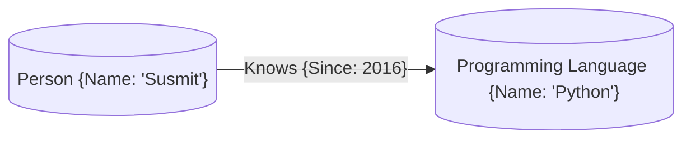

# Neo4j Recommender Workshop - Prepared for VSIT College, Mumbai

## About Me

### Susmit Vengurlekar

### Data Scientist, Backend Developer, AWS Solutions Architect, Neo4j Professional

- Data Scientist at AIDAX
- Certified Neo4j Professional
- Programming Experience of **8+ years**, Corporate Experience of **4+ years** 
- HSC Commerce & Bsc IT from DG Ruparel College, Mumbai

## Let's Cover the Basics first

### What is a Knowledge Graph?

- A Knowledge Graph is a graph database that stores information in the form of nodes and edges
- Nodes represent entities and edges represent relationships between entities
- Properties can be attached to nodes and edges

#### Example




### Intro to Neo4j

- Graph database
- Labels, Nodes, Relationships, and Properties
- Native Graph Storage: Store data using pointers on disk
- Cypher Query Language
- Create only directed relationships, but traverse them any way.


### Intro to Neo4j - Cypher Query Language

#### To find all actors who acted in the movie "The Matrix"


#### Instead of this
```sql
SELECT actors.name
FROM actors
 	LEFT JOIN acted_in ON acted_in.actor_id = actors.id
	LEFT JOIN movies ON movies.id = acted_in.movie_id
WHERE movies.title = "The Matrix"
```

### You can write this
```cypher
MATCH (actor:Actor)-[:ACTED_IN]->(movie:Movie {title: 'The Matrix'})
RETURN actor.name
```


## Enough Talk, Time to Get our Hands Dirty!
1. Spin up neo4j sandbox by going to <a href="https://sandbox.neo4j.com" target="_blank">sandbox.neo4j.com</a>

2. Login with Email ID and Password (if you use social login, don't forget to signout after the session)

3. Choose project having GDS Library enabled

4. Import Movies Dataset

5. Data Exploration using Cypher Queries

6. Naive Recommender System using Cypher Queries (put dummy data of user watching movies)

    - Content Based Filtering
    - Collaborative Filtering

7. Advanced Recommender System using Graph Data Science Library

    - TODO

## Local Setup for hands-on practice
1. **Clone the Repository**  
   ```bash
   git clone https://github.com/susmitpy/neo4j_recommender_workshop.git
   cd neo4j_recommender_workshop
    ```

2. **Use Docker Compose to Start Neo4j**  
   Ensure you have Docker and Docker Compose installed. Then run:
   ```bash
   docker-compose up -d
   ```

3. **Access Neo4j Browser**
    Open your web browser and navigate to `http://localhost:7474`. Use the following credentials to log in:
    - Username: `neo4j`
    - Password: `test1234`

## Learning Resources

- Neo4j Official Documentation - [Neo4j Docs](https://neo4j.com/docs/)

- Neo4j Courses @ Graph Academy - [Graph Academy](https://graphacademy.neo4j.com/categories/)

- Neo4j Cypher Refcard - [Cypher Refcard](https://neo4j.com/docs/cypher-refcard/current/)

- Certifications - [Neo4j Certifications](https://graphacademy.neo4j.com/certifications/)
    - Neo4j Certified Professional
    - Neo4j Graph Data Science Certification

- My session of QnA on Neo4j Knowledge Graph at Graph Database Mumbai Meetup - [Watch Here](https://youtu.be/JpysxH4Z5Fw)